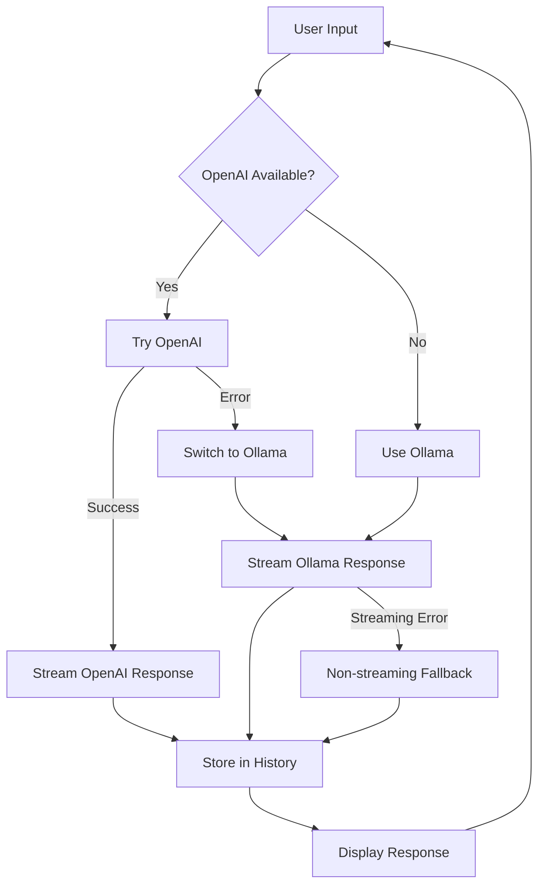

# 🤖 Hybrid AI Agent System

A smart AI agent that automatically switches between **OpenAI API** and **local Ollama** models with real-time streaming support and seamless fallback functionality.

## ✨ Features

- 🔄 **Automatic Fallback**: Uses OpenAI when available, falls back to Ollama when connection fails
- 🌊 **Real-time Streaming**: Both models stream responses character by character
- 💬 **Conversation Memory**: Maintains context across both models
- 🚀 **Zero Configuration**: Works automatically based on API key availability
- 🛡️ **Error Handling**: Graceful fallback with informative status messages

## 🚀 Quick Start

### Prerequisites

- Python 3.11+
- Ollama installed and running locally
- (Optional) OpenAI API key for enhanced performance

### Installation

```bash
# Clone the repository
git clone <your-repo-url>
cd tutor_agent

# Install dependencies
uv sync

# (Optional) Set up OpenAI API key
export OPENAI_API_KEY="your-api-key-here"
```

### Running the Agent

```bash
# Start the hybrid agent
uv run local_llm/local_llm_fallback.py
```

## 📋 How It Works

### Step-by-Step Process

1. **🔍 Initialization**

   - Checks for OpenAI API key in environment variables
   - If found: Initializes OpenAI client and sets as primary model
   - If not found: Uses Ollama as primary model
   - Displays connection status with ✅ or ⚠️ indicators

2. **💬 User Input**

   - Prompts user with "You: "
   - Accepts any text input
   - Supports exit commands: "exit", "quit", "bye"

3. **🧠 AI Processing**

   - **OpenAI Path** (if available):
     - Sends request to OpenAI API with streaming enabled
     - Displays response character by character in real-time
     - If error occurs: Shows warning and switches to Ollama
   - **Ollama Path** (fallback or primary):
     - Sends request to local Ollama server
     - Streams response character by character
     - If streaming fails: Falls back to non-streaming mode

4. **📝 Response Handling**

   - Displays streaming response in real-time
   - Stores full response in conversation history
   - Maintains context for future interactions
   - Shows "TutorAgent: [response]" after streaming completes

5. **🔄 Continuous Loop**
   - Returns to step 2 for next user input
   - Maintains conversation context across all interactions
   - Handles model switching seamlessly during conversation

## 🏗️ Architecture

### Core Components

- **`OllamaAgent`**: Handles local Ollama model interactions
- **`HybridAgent`**: Manages OpenAI/Ollama switching logic
- **`Agent`**: OpenAI Agents SDK integration for session management
- **`SQLiteSession`**: Persistent conversation storage

### Data Flow

```
User Input → HybridAgent → OpenAI (if available) → Stream Response
                ↓ (if error)
            OllamaAgent → Stream Response → Display
```

## 🔧 Configuration

### Environment Variables

```bash
# Optional: OpenAI API key for enhanced performance
OPENAI_API_KEY=your-openai-api-key

# Ollama configuration (defaults)
OLLAMA_HOST=http://127.0.0.1:11434
OLLAMA_MODEL=llama3.1
```

### Model Settings

- **OpenAI**: GPT-3.5-turbo with temperature 0.7
- **Ollama**: llama3.1 (configurable)
- **Streaming**: Enabled for both models
- **Fallback**: Automatic with error handling

## 📊 Status Messages

| Message                                                | Meaning                                      |
| ------------------------------------------------------ | -------------------------------------------- |
| `✅ OpenAI API connected - using OpenAI for responses` | OpenAI is primary, Ollama is fallback        |
| `⚠️ OpenAI API error: [error]`                         | OpenAI failed, switching to Ollama           |
| `🔄 Switching to Ollama local model`                   | Fallback activated                           |
| `⚠️ Ollama streaming error: [error]`                   | Ollama streaming failed, using non-streaming |

## 🛠️ Troubleshooting

### Common Issues

1. **Ollama not running**

   ```bash
   # Start Ollama service
   ollama serve
   ```

2. **Model not found**

   ```bash
   # Pull the required model
   ollama pull llama3.1
   ```

3. **OpenAI API errors**
   - Check API key validity
   - Verify internet connection
   - System will automatically fall back to Ollama

### Error Handling

- **Connection errors**: Automatic fallback to Ollama
- **Streaming errors**: Falls back to non-streaming mode
- **Model errors**: Graceful error messages with suggestions

## 🎯 Use Cases

- **Development**: Local AI development with cloud fallback
- **Privacy**: Sensitive conversations using local models
- **Reliability**: Uninterrupted service even with API failures
- **Cost-effective**: Free local processing with premium cloud backup

## 🔄 Model Switching Logic



## 📈 Performance

- **OpenAI**: Fast, high-quality responses with streaming
- **Ollama**: Local processing, no internet required
- **Fallback**: Seamless switching without conversation loss
- **Memory**: Efficient conversation history management

## 🤝 Contributing

1. Fork the repository
2. Create a feature branch
3. Make your changes
4. Test with both OpenAI and Ollama
5. Submit a pull request

## 📄 License

This project is open source and available under the MIT License.

## 🆘 Support

- **Issues**: Create an issue on GitHub
- **Documentation**: Check this README
- **Community**: Join our discussions

---

**Made with ❤️ for the AI community**
